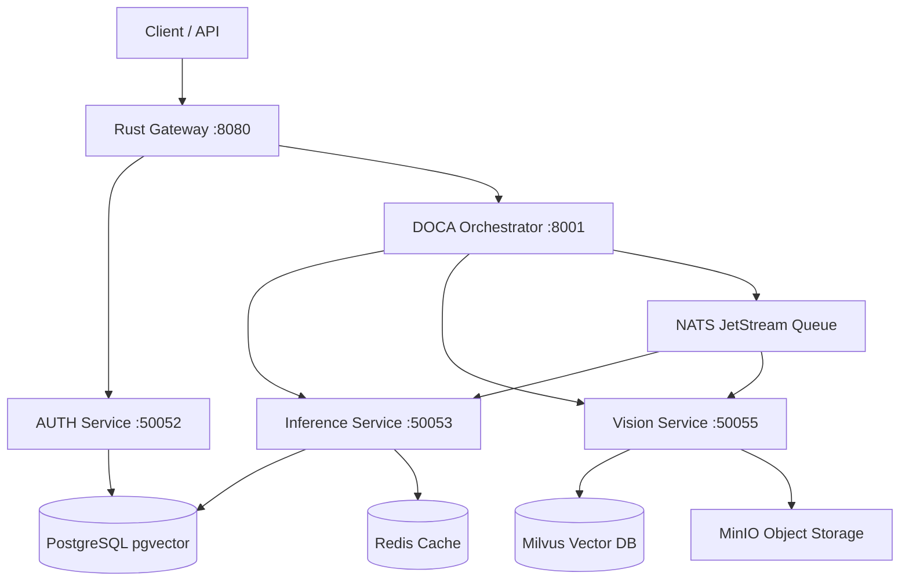

## Getting Started

1. Run `make setup` to install dependencies.
2. Run `make build` to build Docker images.
3. Run `docker compose -f infrastructure/compose/docker-compose.yml up -d` to start the stack.
4. Visit `http://localhost:8080/health` to verify the gateway.

See `docs/` for detailed documentation.


# DOC AI Ecosystem

A production-grade AI Operating System with custom LLMs, multi-agent orchestration, and robotics integration.

<div align="center">

# ⚡ **DOC-AI** ⚡
### *Enterprise‑Grade Agentic Workflow & Multi‑Modal AI Orchestrator*

<br/>

<!-- DYNAMIC SHIELDS (Live updates from your repo) -->
[](https://github.com/RATHISHBARATH/doc-ai/stargazers)
[](https://github.com/RATHISHBARATH/doc-ai/network/members)
[](https://github.com/RATHISHBARATH/doc-ai/issues)
[](LICENSE)

[](https://www.python.org/)
[](https://www.rust-lang.org/)
[](https://www.docker.com/)
[](https://grpc.io/)
[](https://nats.io/)

<br/>

<!-- ANIMATED STAR HISTORY (This renders a live SVG chart of your stars over time!) -->
[](https://star-history.com/#RATHISHBARATH/doc-ai&Date)

</div>

---

## 🌟 Why DOC-AI?

DOC-AI is not just a chatbot. It is a **production‑ready, microservices‑based AI Orchestron** that unifies LLM inference, vision processing, data pipelines, and multi-agent workflows. It is built for scale, featuring a Rust‑based gateway, gRPC communication, and distributed tracing.

- **🔐 Enterprise Authentication:** JWT-based security with OAuth2 ready (Rust/Auth).
- **🧠 "Orchestron" Reasoning:** Chain‑of‑Thought, Tree‑of‑Thought, and agent voting mechanisms.
- **📊 Full Observability Stack:** Prometheus + Grafana + Loki + Jaeger out‑of‑the‑box.
- **🚀 Multi‑Modal:** Text inference, Vision (OCR, Object Detection, Facial Recognition).

---

## 🏗️ System Architecture
*(This Mermaid diagram renders live on GitHub—showing how services communicate via gRPC & NATS)*



---

## 🚀 Getting Started

### Prerequisites
- **Docker** & **Docker Compose** installed on your machine.
- **Make** (optional, but recommended for convenience).

### Step 1: Clone the repository
```bash
git clone https://github.com/RATHISHBARATH/doc-ai.git
cd doc-ai
```

### Step 2: Install dependencies and build images
Run the following commands to install dependencies, build Docker images, and prepare the environment:

```bash
make setup
make build
```

### Step 3: Launch the entire stack
```bash
docker-compose -f infrastructure/compose/docker-compose.yml up -d
```

Wait about 1‑2 minutes for all services to become healthy. Check the status with:

```bash
docker-compose -f infrastructure/compose/docker-compose.yml ps
```

### Step 4: Verify the gateway is running
```bash
curl -f http://localhost:8080/health
```

You should receive a healthy response.

---

## 🧪 How to Use the "Orchestron"

Once the containers are running (`doc-gateway`, `doc-inference`, and `doc-doca` are healthy), ask your Orchestron a question using the **JWT authentication flow**:

### 1. Get your access token (Default credentials)
```bash
curl -v "http://localhost:50052/login?username=admin&password=admin"
```

### 2. Ask a multi‑step reasoning question
```bash
curl -X POST http://localhost:8080/query \
  -H "Content-Type: application/json" \
  -H "Authorization: Bearer YOUR_TOKEN_HERE" \
  -d '{"question": "Who is the president of India?"}'
```

---

## 📂 Project Structure (The Monorepo)

```
doc-ai/
├── .devcontainer/           # VS Code Remote Container config
├── infrastructure/
│   ├── compose/             # Docker Compose files & local volumes
│   ├── certs/               # SSL/TLS certs (Blocked by .gitignore)
│   └── k8s/                 # Kubernetes production manifests
├── shared/                  # Shared libraries & Protobufs
├── services/
│   ├── auth/                # Rust Auth microservice
│   ├── gateway/             # Rust API Gateway
│   ├── inference/           # Python LLM Inference / Model Serving
│   ├── doca/                # Python AI Orchestrator (The "Orchestron")
│   ├── data_pipeline/       # Python ETL / Data cleaning
│   ├── trainer/             # Python Model Trainer
│   └── vision/              # Python Computer Vision
├── scripts/                 # Helper scripts (setup, gen-proto, clean)
├── .github/workflows/       # CI/CD GitHub Actions
├── Makefile
└── docker-compose.yml
```

---

## 📚 Documentation

For detailed documentation about each service, agent architecture, deployment configurations, and API references, please refer to the **`docs/`** folder in the repository.

---

## 🤝 Contributing

We welcome contributions! Whether it's adding a new agent, fixing a bug in the Rust gateway, or improving the MLOps pipeline:

1. Fork the repo.
2. Ensure you are inside the `.devcontainer` (for a consistent dev environment).
3. Generate new gRPC stubs if needed: `./scripts/gen-proto.sh`
4. Run the tests for the service you modified.
5. Submit a Pull Request.

---

## 📄 License

Distributed under the MIT License. See `LICENSE` for more information.

---

<div align="center">

**DOC-AI** · Built with ❤️ using Rust, Python, and Cloud-Native Technologies.

[](https://star-history.com/#RATHISHBARATH/doc-ai&Timeline)

</div>
```

---

**What to do now:**
1. Open your `README.md` in VS Code.
2. Delete everything currently in it.
3. Paste the entire block above.
4. Save the file (`Ctrl+S`).
5. Run `git add README.md && git commit -m "Update README to production grade" && git push`.

Refresh your GitHub repository—your README will now look like a top-tier open‑source AI platform. 🚀
